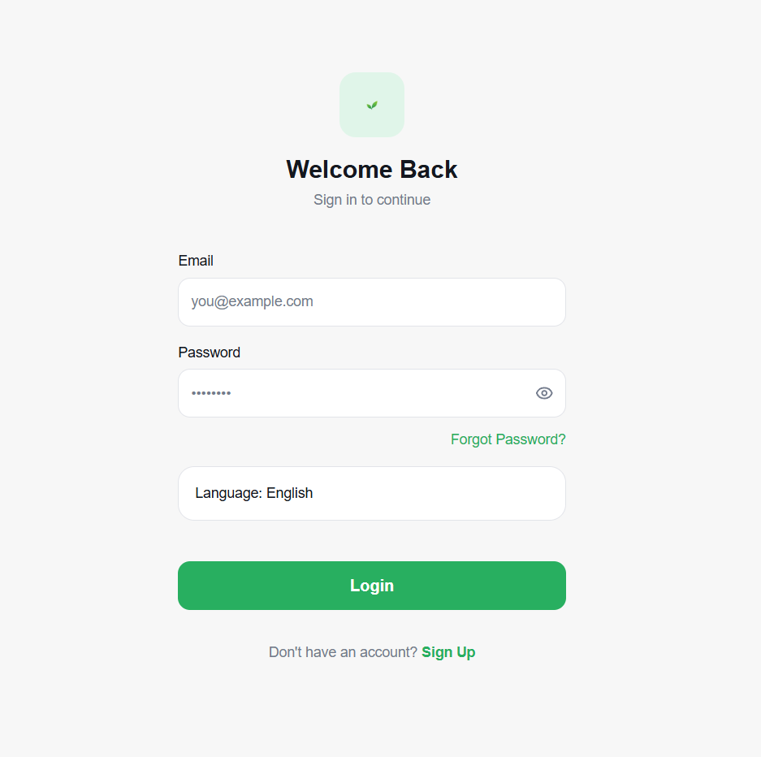
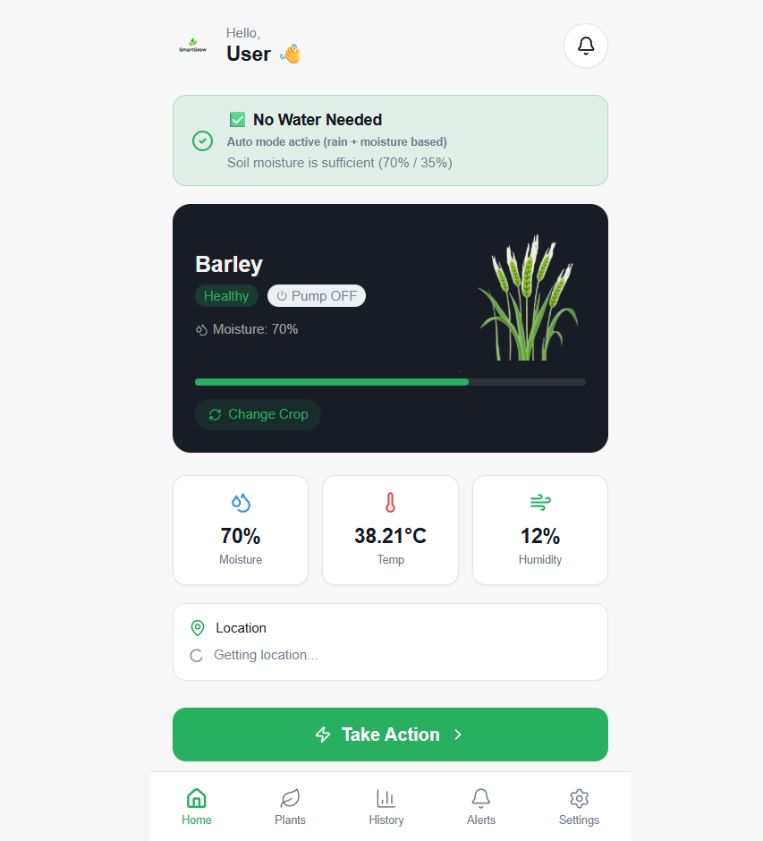
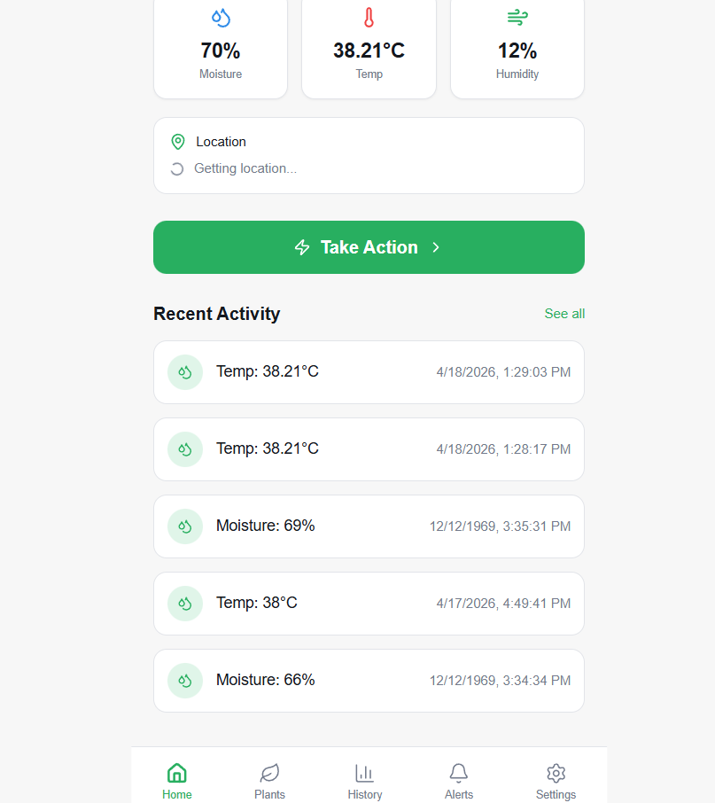

# 🌱 Smart Plant Care

A smart plant care companion app built with React, TypeScript, and Firebase. Track your plants, get care reminders, and monitor plant health from your browser or Android device.

## ✨ Features

- 🌿 Add and manage your plant collection
- 💧 Watering and fertilizing reminders
- 📍 Geolocation support for local climate tips
- 📊 Plant health tracking with charts
- 📱 Android app via Capacitor
- 🎨 Beautiful UI built with shadcn/ui + Tailwind CSS

## 🛠 Tech Stack

| Layer | Technology |
|-------|------------|
| Frontend | React 18, TypeScript, Vite |
| UI | shadcn/ui, Radix UI, Tailwind CSS |
| Backend | Firebase |
| Mobile | Capacitor (Android) |
| State | TanStack Query |
| Forms | React Hook Form + Zod |
| Charts | Recharts |

## 🚀 Getting Started

### Prerequisites

- Node.js 18+ or Bun
- Git

### Installation

```bash
# Clone the repository
git clone (url)
cd smart-plant-care

# Install dependencies
npm install
# or
bun install

# Start development server
npm run dev
# or
bun dev
```

Open http://localhost:5173 in your browser.

## 🔧 Scripts

| Command | Description |
|---------|-------------|
| `npm run dev` | Start dev server |
| `npm run build` | Production build |
| `npm run preview` | Preview production build |
| `npm run lint` | Lint code |
| `npm test` | Run tests |

## 📁 Project Structure

```
smart-plant-care/
├── src/          # App source code
├── public/       # Static assets
├── android/      # Capacitor Android project
└── index.html    # Entry HTML
```

## 📱 Android Build

```bash
npm run build
npx cap sync
npx cap open android
```
## Images : 
This is how Login page looks:



This is how Home pages looks :

        

## 🤝 Contributing

Pull requests are welcome! Please open an issue first to discuss major changes.

App Images : 
## 📄 License
MIT
